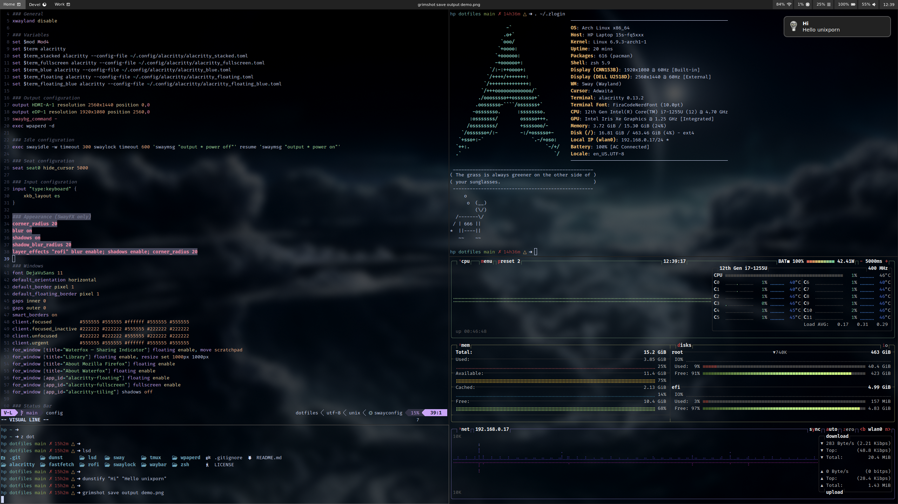

# Dotfiles

My personal dotfiles.

## Configs

- [zsh](https://github.com/zsh-users/zsh) + [omz](https://github.com/ohmyzsh/ohmyzsh)
- [foot](https://codeberg.org/dnkl/foot)
- [alacritty](https://github.com/alacritty/alacritty)
- [fastfetch](https://github.com/fastfetch-cli/fastfetch)
- [tmux](https://github.com/tmux/tmux)
- [nnn](https://github.com/jarun/nnn)
- [elinks](https://github.com/rkd77/elinks)
- [lsd](https://github.com/lsd-rs/lsd)
- [lazygit](https://github.com/jesseduffield/lazygit)
- [delta](https://github.com/dandavison/delta)
- [aichat](https://github.com/sigoden/aichat)
- [ncspot](https://github.com/hrkfdn/ncspot)
- [cava](https://github.com/karlstav/cava)
- [peaclock](https://github.com/octobanana/peaclock)
- [fuzzel](https://codeberg.org/dnkl/fuzzel)
- [waybar](https://github.com/Alexays/Waybar)
- [swayidle](https://github.com/swaywm/swayidle)
- [swalock](https://github.com/swaywm/swaylock)
- [swabg](https://github.com/swaywm/swaybg)
- [wpaperd](https://github.com/danyspin97/wpaperd)
- [dunst](https://github.com/dunst-project/dunst)
- [cliphist](https://github.com/sentriz/cliphist)
- [wl-clipboard](https://github.com/bugaevc/wl-clipboard)
- [sway-contrib](https://github.com/OctopusET/sway-contrib)
- [wireplumber](https://gitlab.freedesktop.org/pipewire/wireplumber)

## Neovim config

- [1riz/nvim](https://github.com/1riz/nvim)

## OhMyZsh plugins

- [1riz/omz-plugins](https://github.com/1riz/omz-plugins)

## Fonts

- [monaspace](https://github.com/githubnext/monaspace)
- [firacode-nerd](https://github.com/ryanoasis/nerd-fonts)

## Wallpaper

- [unix-blue-digital](https://wallpapers.com/wallpapers/unix-blue-digital-logo-kxb7r2sx50zqdi6a.html)

## Screenshots

